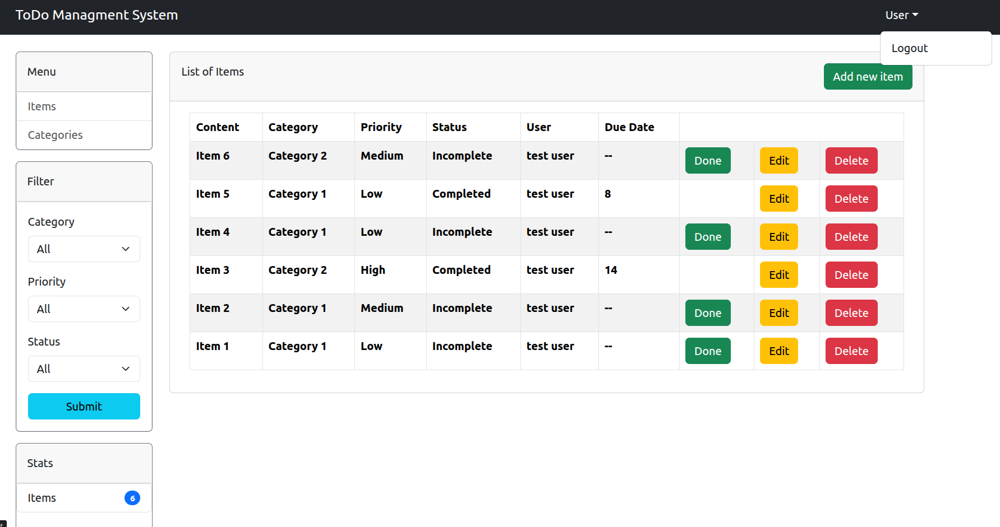
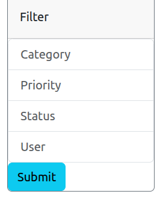
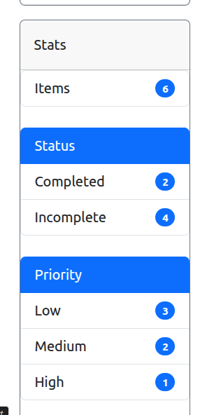
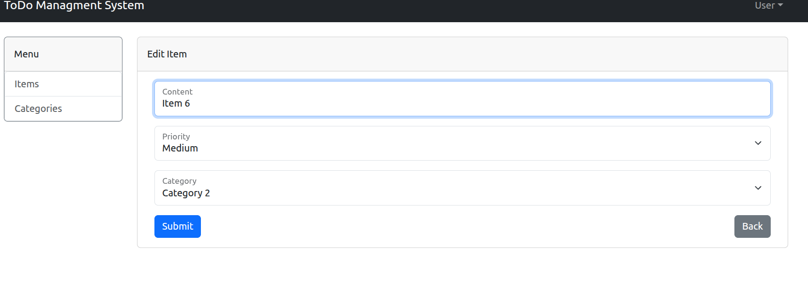

# 🗂 Tech Stack

Below is a list of technologies we use at this project

*  🎨 **Frontend:**  React, Bootstrap 5
* 🏗 **Backend:** Laravel 12, PHP 8.4
* 📚 **Database:** Sqlite

# 💻 How to Install
## Install using laravel server and Sqlite
### 1. Set environment variables
First you need to create ```.env``` file in the main directory with the data from ```.env.example``` file.

### 2. Create Database
You need to create ```database.sqlite``` file in the ```/database``` directory . Move ```database.sqlite.example``` file from root directory to ```/database``` and removing extension ```.example``` .

### 3. Install Composer Packages
```
composer install
```

### 4. Generate Key
```
php artisan migrate
```

### 5. Generate Key
```
php artisan key:generate
```

### 6. Run Server
```
php artisan serve
```

## Install ReactJS Application and start
### 1. Install all addons from ```package.json```
```
npm install
```

### 4.Generated files
```
npm run build
```

### 4.Start application
```
npm start
```

# Site Address
## ReactJS addres
> http://localhost:3000/

## API Address
> http://127.0.0.1:8000/


# 📊 User interface

### Dashboard


### Filter Menu


### Statistics Menu


### Edit Menu



# 📤 API Endpoint

## User endpoint

### Registration for all users

```
[ POST ]   /api/auth/register
```

### Login url

```
[ POST ]   /api/auth/login
```

Return token:
```
    {
        "token" : Bearer 2|HKUXsXlBfSkk5MMNARj1GFQ3G3GC2BXhvYudR8E994474740
    }
```

### Logout url

Headers:
````
    Authorization: Bearer 2|HKUXsXlBfSkk5MMNARj1GFQ3G3GC2BXhvYudR8E994474740 
    Content-Type: application/json
````

```
[ POST ]   /api/auth/logout
```

## Item endpoint

### Get all items

```
[ GET ]   /api/item/
```

### Get one items

```
[ GET ]   /api/item/{id}
```

### Update item
Headers:
````
    Authorization: Bearer 2|HKUXsXlBfSkk5MMNARj1GFQ3G3GC2BXhvYudR8E994474740 
    Content-Type: application/json
````

Params:
```
{
    "content" : "Item 2",
    "priority": "low",
    "is_completed" : true,
    "category_id" : 2
}
```
```
[ PUT ]    /api/item/{id}
```

### Create item
Headers:
````
    Authorization: Bearer 2|HKUXsXlBfSkk5MMNARj1GFQ3G3GC2BXhvYudR8E994474740 
    Content-Type: application/json
````

Params:
```
{
    "content" : "Item 2",
    "priority": "low",
    "is_completed" : true,
    "category_id" : 2
}
```
```
[ POST ]    /api/item/
```

### Delete item

Headers:
````
    Authorization: Bearer 2|HKUXsXlBfSkk5MMNARj1GFQ3G3GC2BXhvYudR8E994474740 
    Content-Type: application/json
````

Params:
```
{
    "content" : "Item 2",
    "priority": "low",
    "is_completed" : true,
    "category_id" : 2
}
```
```
[ DELETE ]    /api/item/{id}
```
### Completed item
Headers:
````
    Authorization: Bearer 2|HKUXsXlBfSkk5MMNARj1GFQ3G3GC2BXhvYudR8E994474740 
    Content-Type: application/json
````
```
[ PUT ]    /api/completed/{id}
```

## Category endpoint

### Get all category

```
[ GET ]   /api/category/
```

### Get one category

```
[ GET ]   /api/category/{id}
```
### Update category
Headers:
````
    Authorization: Bearer 2|HKUXsXlBfSkk5MMNARj1GFQ3G3GC2BXhvYudR8E994474740 
    Content-Type: application/json
````

Params:
```
{
    "name" : "Category name",
}
```
```
[ PUT ]    /api/category/{id}
```

### Create category
Headers:
````
    Authorization: Bearer 2|HKUXsXlBfSkk5MMNARj1GFQ3G3GC2BXhvYudR8E994474740 
    Content-Type: application/json
````

Params:
```
{
    "name" : "Category name",
}
```
```
[ POST ]    /api/category/
```

### Delete category
Headers:
````
    Authorization: Bearer 2|HKUXsXlBfSkk5MMNARj1GFQ3G3GC2BXhvYudR8E994474740 
    Content-Type: application/json
```
```
[ DELETE ]    /api/category/{id}
```
